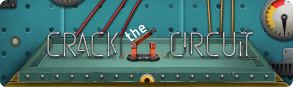
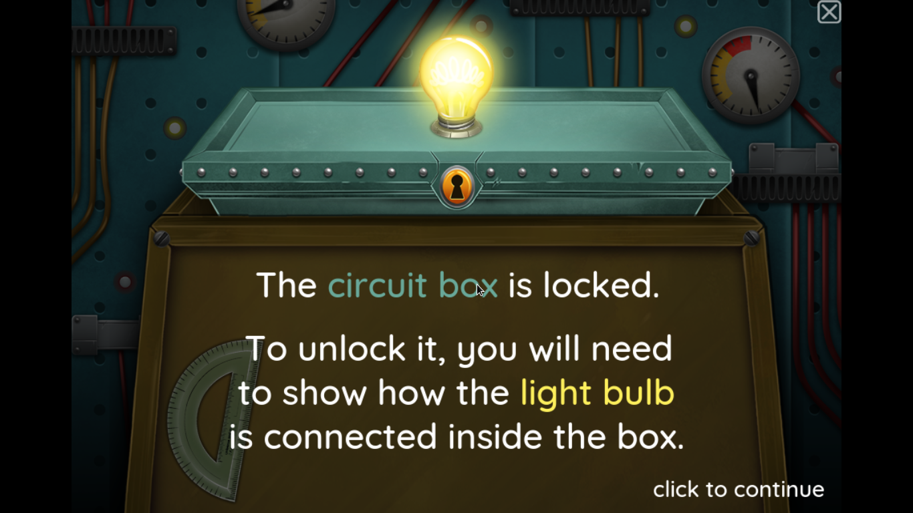
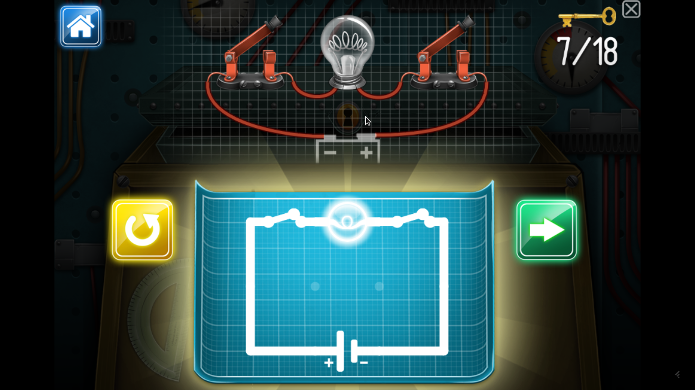

# Crack the Circuit: Game

<p align="center"> </p>

## About

A puzzle game about eletronic circuits that you have to crack 18 circuits and make them shine(I mean, work)!)

Indeed to be utilized by newcomer students who are learning electronic and electrical circuits. May also be utilized by teachers when teaching students.

---

## Online Demo

You can play the demo online at [http://theuniverseandmore.com/crackthecircuit/](http://theuniverseandmore.com/crackthecircuit/)

---

## Screenshots

#### Start Screen: 


#### Gameplay:



---

## Running

To run locally in your machine, just run:

```
$ git clone https://github.com/TheUniverseAndMore/Crack-the-Circuit.git && cd Crack-the-Circuit.git
$ python -m SimpleHTTPServer 8080
```

Now navigate through your web browser to: `http://localhost:8080`, good game!

**Note:** If you don't have python installed you may try simple PHP HTTP server instead, running: `php -S 127.0.0.1:8080` inside the project root directory.

---

## Credits

Created by [The Universe and More, Inc](http://theuniverseandmore.com) a 501(c)3 Nonprofit Organization.